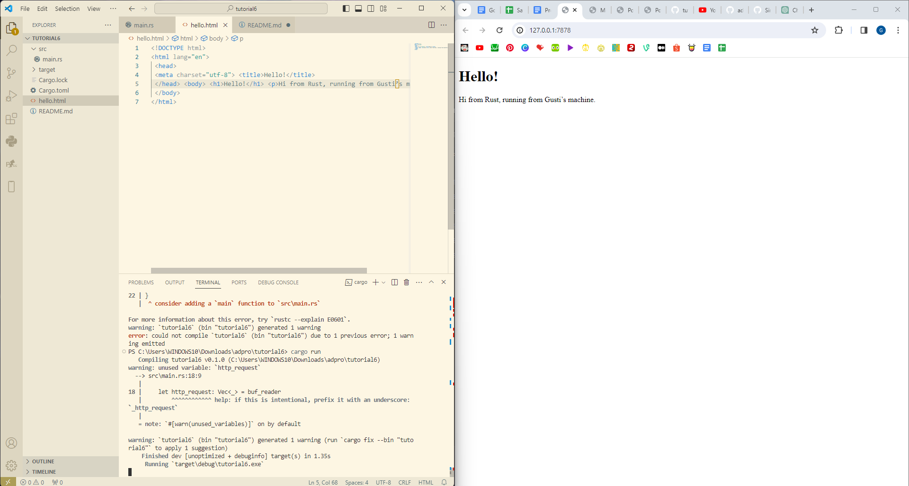
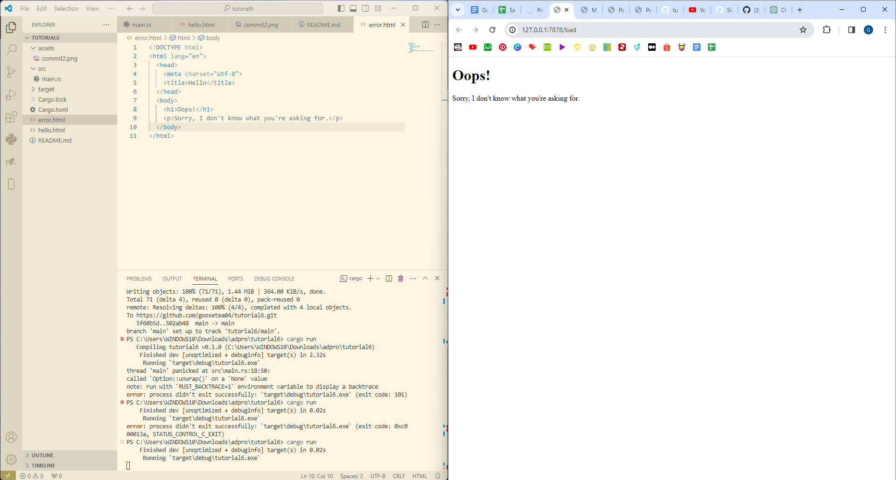

## Commit 1 Reflection Notes

The function initially wraps the input stream with a BufReader for efficient content reading. It then iterates over each line from the stream using a line iterator, mapping operations to convert them into strings. These strings are processed until an empty line is encountered, accumulating into an http_request vector. Finally, this vector, containing the HTTP request information, is printed to the terminal. The function efficiently parses incoming streams by iteratively extracting HTTP request details. Through a sequence of mapping and iteration operations, it constructs a structured representation of the request, suitable for further processing or analysis.

## Commit 2 Reflection Notes 

Initially, the program employs a similar method as previously described to read the incoming request. Once the request is obtained and read, the program proceeds to construct an HTTP Response. This response comprises three key components: a status line containing the HTTP version, status code, and status message; the Content-length header indicating the length of the content; and finally, the content itself, which in this instance is the HTML to be served.

To create the response, the program first segregates each of these components into separate string variables. Subsequently, through string formatting techniques, the program amalgamates these features into a single string, adhering to the specified order: status line, Content-length header, and content. The status line and Content-length header are delimited by a single \r\n, while the header section and content section are separated by two \r\ns. Once the response string is assembled, the program proceeds to write it back into the stream as bytes, thereby furnishing the client with the requested HTML response.

In summary, following the acquisition of the request, the program dynamically constructs an HTTP Response by amalgamating essential components into a structured string format. This response string, delineated by specific delimiters, is then transmitted back to the client via the stream, ensuring the prompt delivery of the requested HTML content.

## Commit 3 Reflection Notes

To distinguish between different types of requests and determine the appropriate response, the program examines the URI specified in the status line's second parameter. This URI represents the specific content of the URL beyond the destination information and serves as a key identifier for request categorization. Here, only requests with a URI of '/' are considered valid, prompting the delivery of the 'hello.html' file with a success status code. Requests with any other URI are deemed invalid, triggering the return of an error not found status code  as well as retunring the 'error.html' page. By dynamically setting the filename and status line based on the URI, the program streamlines response processing, reducing redundancy in code and ensuring uniform handling regardless of the specific request type.

## Commit 4 Reflection Notes

What separates processes in this commit and the previous is that is the fact that we are now waiting for the response to wait sleep first. We are waiting for '/sleep' to finish first. The way that the program handles requests is that now we are waiting for an incoming stream. It then processes to the next stream. With the '/sleep' endpoint, we now wait for the program to finish processing before working on the next request. 

## Commit 5 Reflection Notes

Firstly, a message passing channel is established to facilitate communication between a pool and individual threads, allowing the transmission of tasks for execution. The ThreadPool then creates a collection of workers, each possessing a unique identifier and a clone of the receiver obtained from the message passing channel. Upon initialization, each worker spawns a thread that continuously waits until it receives a task from the associated receiver. A task is encapsulated within a box containing an executable function namely, FnOnce(). Once a worker receives a task, it exclusively executes it until completion, during which time its receiver remains locked, preventing the acceptance of further tasks until the ongoing one concludes. By creating a vector of Workers, a finite number of threads are established, each equipped with a receiver for task retrieval, thereby constituting a self-looping mechanism until assigned a job.

Subsequently, the ThreadPool is instantiated with the collection of workers and the sender obtained during the creation of the message passing channel. Upon invocation of ThreadPool.execute, which expects a function as input, the provided function is encapsulated within a Box to form a task, which is then dispatched by an available worker using the sender associated with the ThreadPool. In the main code, a thread pool comprising four workers is initialized. Whenever a stream is received from the TCPListener, ThreadPool.execute is invoked with handle_connection(stream) as the input, thereby assigning the HTTP request handling task to a worker for execution.